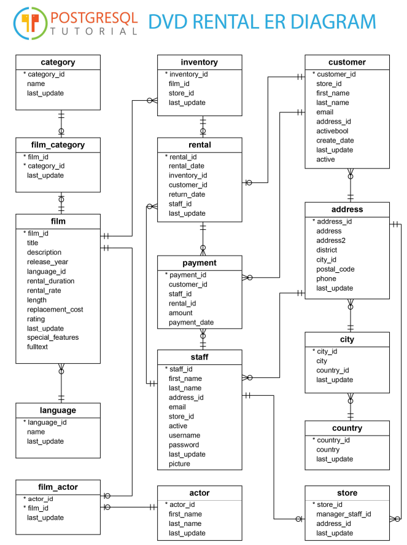

# MasterPostgres

## Overview
This repository is dedicated to mastering PostgreSQL using the DVD Rental dataset. It contains various SQL scripts, queries, and exercises designed to help you become proficient in PostgreSQL.

## Dataset
The DVD Rental dataset is a sample database provided by PostgreSQL. It contains information about a DVD rental store, including customers, payments, rentals, and inventory.

## DVD Rental Database ER Diagram



## Getting Started

### Prerequisites
- PostgreSQL installed on your machine
- Basic knowledge of SQL

### Installation
1. Clone the repository:
    ```sh
    git clone https://github.com/girishSaiWork/MasterPostgres.git
    cd MasterPostgres
    ```
2. Download the DVD Rental dataset from [PostgreSQL Sample Databases](https://www.postgresqltutorial.com/postgresql-sample-database/).

3. Restore the DVD Rental database:
    ```sh
    pg_restore -U postgres -d dvdrental dvdrental.tar
    ```

## Contributing
Contributions are welcome! Please fork the repository and submit a pull request.

## License
This project is licensed under the MIT License - see the [LICENSE](LICENSE) file for details.

## Acknowledgements
- [PostgreSQL Tutorial](https://www.postgresqltutorial.com/)
- [DVD Rental Sample Database](https://www.postgresqltutorial.com/postgresql-sample-database/)